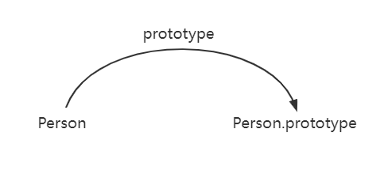
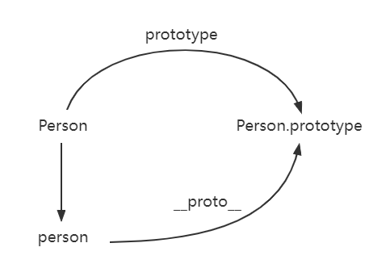
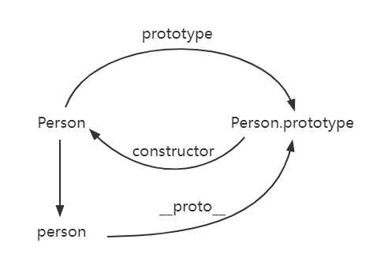
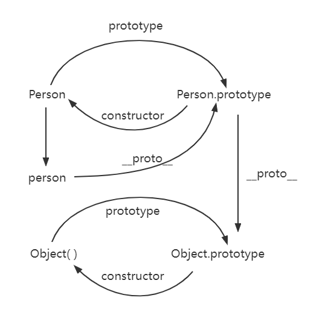
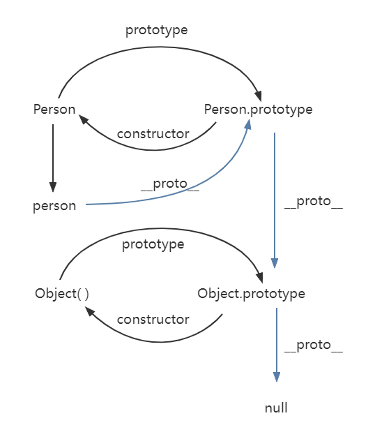

## Use Constructor Function create an object

```
function Person() {
}

var person = new Person();
person.name = 'Kevin';

console.log(person.name) // Kevin
```

In the example above, _Person_ is a _constructor_ and we use _new_ created an instance _person_.

## Prototype

Each Function has a _prototype_ attribute, e.g.

```
function Person() {

}
Person.prototype.name = 'Kevin';

var person1 = new Person();
var person2 = new Person();

console.log(person1.name) // Kevin
console.log(person2.name) // Kevin
```

So, what is the stuff that the prototype point to in this function? Is the prototype of this function?

The prototype of the function points to an object which is the prototype of the instance, created by calling the constructor function. In the example above, the prototype of the function points to the prototype of person1 and person2.

But what is the prototype? We have been talking about it for a long time. Here is my understanding of the prototype. Each JavaScript object(except null) will be connected with something when it has been created, and we named that something as the prototype, each object will inherit attributes from the prototype.



## \_\_proto\_\_

Q: What is the relationship between the instance and its prototype?

A: We have \_\_proto\_\_ attribute describe this relationship. Every JS object(except null) has this attribute and \_\_proto\_\_ will point to the prototype of the object.

Try it in your browser:

```
function Person() {

}
var person = new Person();

console.log(person.__proto__ === Person.prototype); // true
```



## Constructor

Here is the third attribute we are talking about in this section.

Definition: Each prototype has a constructor attribute points to its own constructor function

Try to console this:

```
function Person() {

}
console.log(Person === Person.prototype.constructor); // true
```



☕Take a break and here is the summary example of all we have talked about.

```
function Person() {

}
var person = new Person();

console.log(person.__proto__ == Person.prototype) // true
console.log(Person.prototype.constructor == Person) // true
console.log(Object.getPrototypeOf(person) === Person.prototype) // true
```

## Instance and Prototype

Let's start with an example

```
function Person() {

}

Person.prototype.name = 'Kevin';
var person = new Person();

person.name = 'Daisy';
console.log(person.name) // Daisy

delete person.name;
console.log(person.name) // Kevin
```

In this case, we added a name to the instance person, so we could get Daisy when we console the person.name.

When we deleted the person's name attribute, you will find out that Kevin is what we get when we do the console log. Here is the reason that we have already known: when we cannot find the name attribute from the person's \_\_proto\_\_, we will go to the Person.prototype to find the stuff that we need and luckily we can find name attribute on Person.prototype which is Kevin.

So, what if we still cannot find the thing that we need on the prototype?

## Prototype's \_\_proto\_\_

Check the code below

```
var obj = new Object();
obj.name = 'Kevin'

console.log(obj.name) // Kevin
```

Prototype object was created by Object fucntion, as a result, \_\_proto\_\_ of the instance points to the constructor function's prototype.



## Prototype Chain

```
console.log(Object.prototype.__proto__ === null) // true
```

We could find out that the \_\_proto\_\_ of Object.prototype is null.

But what is the null means here?

The value of Object.prototype.**proto** is null and Object.prototype does not have \_\_proto\_\_ is the same thing.

So it could stop finding attributes when it reached the Object.prototype.

The chain structure composed of interrelated prototypes is the prototype chain, that is, the blue line in the pic.



## Notes

### Constructor

```
function Person() {

}
var person = new Person();
console.log(person.constructor === Person); // true
```

When we get person.constructor, person do not have constructor attribute, when it can not read the constructor, it will go to find in the prototype of person.

```
person.constructor === Person.prototype.constructor
```

### \_\_proto\_\_

Most browsers support this non-standard method to access the prototype, however, it does not exist in Person.prototype comes from Object.prototype, which is not so much a property as a getter/setter. When we using obj.\_\_proto\_\_, it could be seems as returning Object.getPrototypeOf(obj).

### Inheritance

## Q&A

Q:
About Function\_\_proto\_\_===Function.prototype
In my understanding that Function is also an instance of Function itself? How to understand the design concept of js, does Function act as chicken and eggs came at the same time?

A:
Function as a built-in object, already exists before it runs, so it will not generate itself according to itself, therefore, there is no which came first question, just the chicken and eggs. As for why Function.\_\_proto\_\_== Function.prototype, I think there are two possibilities: one is to maintain consistency with other functions, and the other is just to indicate a relationship.

In general, I think that there is a Function first, and then the implementation points to the prototype to Function.prototype, but we cannot infer backwards that because of Function.\_\_proto\_\_== Function.prototype, Function calls itself to generate itself.
