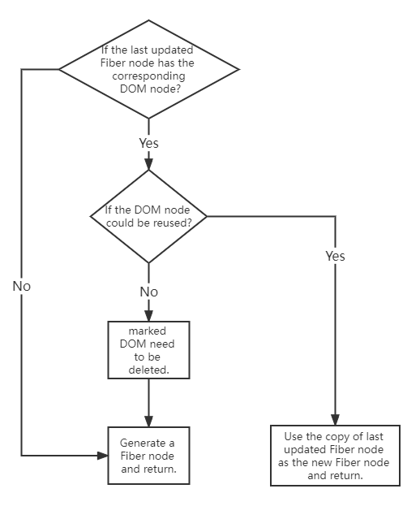

## Single Node

As for `single node`, like `object`, it will call the `reconcileSingleElement`.

[You can check the source code of `reconcileSingleElement` from here.](https://github.com/facebook/react/blob/1fb18e22ae66fdb1dc127347e169e73948778e5a/packages/react-reconciler/src/ReactChildFiber.new.js#L1141)

```js
const isObject = typeof newChild === "object" && newChild !== null;

if (isObject) {
  // object type，could be REACT_ELEMENT_TYPE or REACT_PORTAL_TYPE
  switch (newChild.$$typeof) {
    case REACT_ELEMENT_TYPE:
    // call reconcileSingleElement
    // ...
  }
}
```

This logic of this function should be look like



Let's check how to determine if a DOM node is reusable is implemented in the second step.

```js
function reconcileSingleElement(returnFiber: Fiber, currentFirstChild: Fiber | null, element: ReactElement): Fiber {
  const key = element.key;
  let child = currentFirstChild;

  // If the corresponding DOM node exsit
  while (child !== null) {
    // Judge the key is same
    if (child.key === key) {
      // If the key is same, check the type next

      switch (child.tag) {
        // ...

        default: {
          if (child.elementType === element.type) {
            // same type means it could be reused
            // return the fiber
            return existing;
          }

          // jump out the switch if type is not the same
          break;
        }
      }
      // has the same key but has differnt type
      // mark fiber and its sibling node as delete
      deleteRemainingChildren(returnFiber, child);
      break;
    } else {
      // key is not the same, mark fiber as delete
      deleteChild(returnFiber, child);
    }
    child = child.sibling;
  }

  // create the new Fiber and retuen...
}
```

From the code we could find out that, `React` judge the `key` first, followed by judge the `type`, `DOM node` could be resued only when both `key` and `type` are the same.

When `child !== null`, `key` is same and `type` is not the same, `deleteRemainingChildren` will be excuted, `child` and its sibling `fiber` will be marked delete.

When `child !== null` and `key` is not the same, only `child` will be marked delete.

Think about the example below

When we have three `li` on the page and we want to delete all of these and insert a `p`.

```
// current page
ul > li *3

// new page
ul > p
```

Since only one `p` needs to be updated, it belongs to the single node diff and will follow the logic we have talked about in the article.

The three `fiber` traversaled by `reconcileSingleElement` will trying to find if the `p` could reuse any `DOM` from the previous `fiber`.

When the `key` is same but the `type` is different, which mean we have find the corresponding `fiber` of the `p`, but they are not the same type, cannot be reused. So, delete marked.

When the `key` is not the same, which mean the `fiber` cannot be reused for the `p`, in this case, only `fiber` will be marked delete.

## Practice

Please determine whether the `DOM` elements corresponding to the following JSX objects can be reused.

```
// 1. before update
<div>hello world</div>
// after update
<p>hello world</p>

// 2. before update
<div key="hello">hello world</div>
// after update
<div key="world">hello world</div>

// 3. before update
<div key="hello">hello world</div>
// after update
<p key="world">hello world</p>

// 4. before update
<div key="hello">hello world</div>
// after update
<div key="hello">hello react</div>
```

::: details Check the answer
1. `key prop` was not setted, so default `key == null`. `Key` are the same. Type is `div` before update and it changed to `p` after update, different type cannot be reused.
2. `key` is not the same, so it cannot be resued.
3. `key` is not the same, so it cannot be resued.
4. Both `key` and `type` are not changed, so it could be resued.
:::


