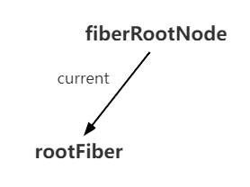
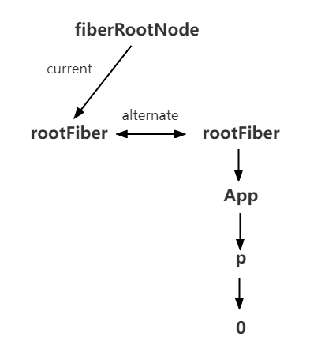
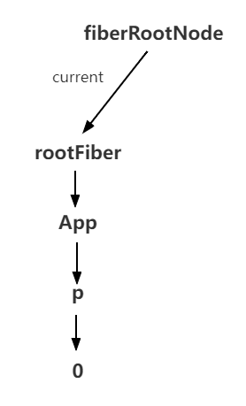
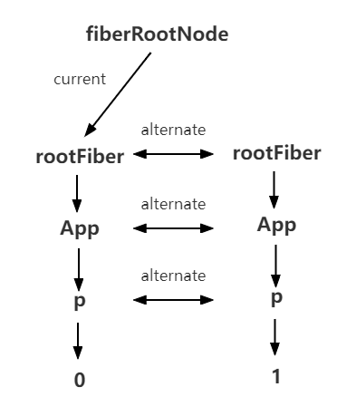
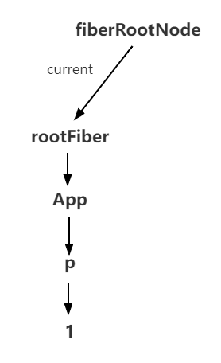

## Foreword

We have talked about what excatly `Fiber` is and we know that `Fiber Nodes` could save its corresponding `DOM Node`.

Aslo, `Fiber Tree` built by `Fiber Nodes` corresponding the `DOM Tree`.

In this section, we will talking about how to use `Double Buffer` for update `DOM`.

## Double Buffer

When we draw animation with `canvas`, `ctx.clearRect` will be called before each frame is drawn to clear the previous frame.

If the current frame includes heavy computation, the `white screen` will appear during the long gap between clearing the previous frame and drawing the current frame.

To solve this problem, we can draw the current frame in the memory and replace the previous frame with the current frame directly after drawing, which will not cause the white screen because the computation time between those two replacement frames is eliminated.

This in-memory build and direct replacement technique is called `double buffer`.

`React` uses `double buffer` to build and replace the `Fiber tree` - corresponding to the creation and update of the `DOM tree`.

## Double Buffer Fiber Tree

There will be at most two `Fiber tree` in `React` at the same time. The `Fiber tree` corresponding to the content currently displayed on the screen is called the `current tree`, and the `Fiber tree` which built in the memory is called the `workInProgress tree`.

The `Fiber node` in the `current Fiber tree` are called `current fiber`, and the `Fiber node` in the `workInProgress Fiber tree` are called `workInProgress fiber`, and they are connected by the `alternate` property.

```js
currentFiber.alternate === workInProgressFiber
workInProgressFiber.alternate === currentFiber
```

The root node of the `React` application switches the `current tree` pointers by making the `current` pointer switch between the different trees `rootFiber`.

That is, when the `workInProgress tree` is built and rendered on the page by the `Renderer`, the `current` pointer of the root node of the application points to the `workInProgress tree`, and the `workInProgress tree` becomes the `current tree`.

Every time the state is updated, a new `workInProgress tree` will be generated and the `DOM` update will be completed by replacing `current` with `workInProgress`.

Next, we will explain the build/replace process when `mount` and `update` with concrete examples.

## mount

Take a look at this example first

```js
function App() {
  const [num, add] = useState(0)
  return <p onClick={() => add(num + 1)}>{num}</p>
}

ReactDOM.render(<App />, document.getElementById('root'))
```

1. The first execution of `ReactDOM.render` creates `fiberRootNode` (called `fiberRoot` in the source code) and `rootFiber`. Where `fiberRootNode` is the root node of the entire application and `rootFiber` is the root node of the component tree where `<App/>` is located.

The reason for the distinction between `fiberRootNode` and `rootFiber` is that we can call `ReactDOM.render` multiple times in the application to render different component trees, and they will have different `rootFiber`. But there is only one root node for the whole application, and that is `fiberRootNode`.

The `current` of the `fiberRootNode` will point to the `Fiber tree` corresponding to the rendered content on the current page, i.e. the `current tree`.



```js
fiberRootNode.current = rootFiber
```

Since it is the first screen rendering, there is no `DOM` mounted in the page yet, so the `rootFiber` pointed by `fiberRootNode.current` does not have any `child node` (i.e. the current Fiber tree is empty).

2. Next, we are going to the `render` phase, which creates `Fiber node` in memory according to the JSX returned by the component and connects them together to build a `Fiber tree`, called `workInProgress tree`. (The right side of the figure below is the tree built in memory, and the left side is the tree displayed on the page)

When building the `workInProgress tree`, we will try to reuse the properties in the existing `Fiber node` in the `current tree`, so that only the root Fiber has a corresponding `current fiber` when the first screen is rendered.



3. The finished `workInProgress tree` on the right side of the figure is rendered to the page at the `commit` stage.

The `current` pointer of the `fiberRootNode` points to the `workInProgress tree` so that it becomes the `current tree`.



## update

1. Next, we click on the `p node` to trigger a state change, which opens a new `render` phase and builds a new `workInProgress tree`.



As the same as `mount`, the `workInProgress fiber` can be created by reusing the node data corresponding to the `current tree`.

::: tip
This process of deciding whether or not to reuse is the `Diff` algorithm, which will be explained in detail in later chapter
:::

2. The `workInProgress tree` is built in the `render` phase and then rendered to the page in the `commit` phase. When rendering is complete, the `workInProgress tree` becomes the `current tree`.



## Summary

We have learned about `React`'s `Scheduler-Reconciler-Renderer` architecture system so far, it should be a good time to introducing a few terms from within the source code.

The phase in which `Reconciler` works is called the `render` phase. This is because the `render` method of the component is called in this phase.

The stage where the `Renderer` works is called the `commit` stage. The `commit` phase renders the information submitted in the render phase on the page, just like you run the `git commit`.

The `render` and `commit` phases are collectively referred to as `work`, i.e. React is at work. Correspondingly, if a task is being scheduled within the `Scheduler`, it is not work.
