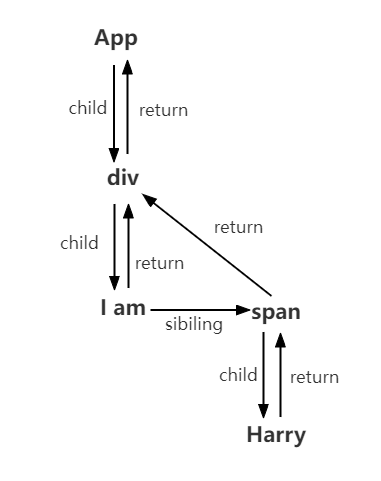

## Foreword

In this chapter we will explain how `Fiber node` are created and `Fiber tree` are constructed.

The `render` phase starts with a call to the `performSyncWorkOnRoot` or `performConcurrentWorkOnRoot` method. This depends on whether the update is `synchronous` or `asynchronous`.

```js
// called by performSyncWorkOnRoot
function workLoopSync() {
  while (workInProgress !== null) {
    performUnitOfWork(workInProgress);
  }
}

// called by performConcurrentWorkOnRoot
function workLoopConcurrent() {
  while (workInProgress !== null && !shouldYield()) {
    performUnitOfWork(workInProgress);
  }
}
```

As you can see the only difference between them is whether they call `shouldYield`. If there is no time left in the current browser frame, `shouldYield` will abort the loop until the browser has free time and then continue loop.

`workInProgress` represents the currently created `workInProgress fiber`.

The `performUnitOfWork` method creates the next `Fiber node` and assigns it to `workInProgress`, and connects `workInProgress` to the created `Fiber node` to form the `Fiber tree`.

[You can check the source code of `workLoopConcurrent` here](https://github.com/facebook/react/blob/970fa122d8188bafa600e9b5214833487fbf1092/packages/react-reconciler/src/ReactFiberWorkLoop.new.js#L1599)

We know that `Fiber Reconciler` is refactored from `Stack Reconciler` to achieve interruptible recursion by traversal.

## Recursion

Start with a depth-first traversal down from the `rootFiber`. The [`beginWork method`](https://github.com/facebook/react/blob/970fa122d8188bafa600e9b5214833487fbf1092/packages/react-reconciler/src/ReactFiberBeginWork.new.js#L3058) is called for each `Fiber node` traversed.

This method creates a `child Fiber node` based on the incoming `Fiber node` and connects the two Fiber nodes.

When the traversal reaches a leaf node (i.e., a component with no children), it enters the next phase.

In the next stage, [`completeWork`](https://github.com/facebook/react/blob/970fa122d8188bafa600e9b5214833487fbf1092/packages/react-reconciler/src/ReactFiberCompleteWork.new.js#L652) is called to process `Fiber node`.

When a `Fiber node` finishes executing `completeWork`, if it has a `sibling Fiber node` (i.e. fiber.sibling ! == null), it enters the first phase of its `sibling Fiber`.

If no sibling Fiber exists, it enters the second phase of the `parent Fiber`.

At this point, the render phase is finished.

## Example

```js
function App() {
  return (
    <div>
      I am
      <span>Harry</span>
    </div>
  );
}

ReactDOM.render(<App />, document.getElementById("root"));
```



During the `render`, the exectuion will be like

```
1. rootFiber beginWork
2. App Fiber beginWork
3. div Fiber beginWork
4. "I am" Fiber beginWork
5. "I am" Fiber completeWork
6. span Fiber beginWork
7. span Fiber completeWork
8. div Fiber completeWork
9. App Fiber completeWork
10. rootFiber completeWork
```

::: tip
The reason why there is no beginWork/completeWork for "Harry" Fiber is that React handles it specially as a performance optimization for Fiber that has only a single text child node.
:::

We will talk about `beginWork` and `completeWork` in the following articles.
