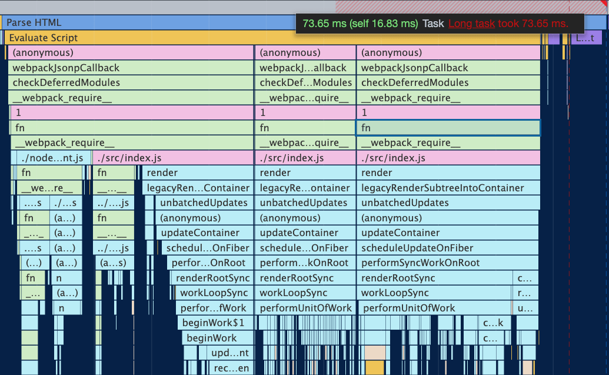

## Concept of React

Let's see how `React` team describe their product.

> React is, in our opinion, the premier way to build big, fast Web apps with JavaScript. It has scaled very well for us at Facebook and Instagram.

You might found that they use the word `fast` to describe `React`. So, we could start from disscuss the factor that might affect the speed of response. In our daily life, there are two scenarios might affect the response speed, which includes

- When encountering large computation operations or insufficient performance of the device, the FPS frops, result in stutters.
- After sending internet request, it might take while for get response so that cannot response fast.

And we could summary these two as

- Bottleneck of CPU
- Bottleneck of IO

How does `React` handle these problems?

## Bottleneck of CPU

It is very easy to meet the bottleneck of CPU when the project is huge and has a lot of components.

Think about the example when we are going to render 3000 `li`.

```js
function App() {
  const len = 3000;
  return (
    <ul>
      {Array(len)
        .fill(0)
        .map((_, i) => (
          <li>{i}</li>
        ))}
    </ul>
  );
}

const rootEl = document.querySelector("#root");
ReactDOM.render(<App />, rootEl);
```

Most browsers have 60Hz screen refresh rate, which means the browser refresh every 16.6ms (1000ms / 60Hz).

As we known, JS could manipulate the DOM and the `thread of GUI rendering` is mutually exclusive with the `thread of JS`. So that the JS script, browser layout and render cannot execute synchronously.

Which means these work needs to be done in 16.6ms

```
JS script --> layout --> render
```

If the runtime of JS needs more than 16.6ms, which means there is not time left for the layout and render.

From the example above, the script might needs more time for JS execution based on the amount of the components. From the following pic, we could find out that the runtime of the JS is 73.65ms from the execution stack, which is much more than a FPS, it causes the FPS drops and page stutter.



Can we solve this problem? The answer is yes, and `React` has already solve this for us.

`React` leave some space for JS thread in each FPS and use the time for update the component. You can [check here](https://github.com/facebook/react/blob/1fb18e22ae66fdb1dc127347e169e73948778e5a/packages/scheduler/src/forks/SchedulerHostConfig.default.js#L119) to find out that React leave 5ms for JS thread in default.

When the time is not enough for the script, `React` will give the control back to browser for it to render UI. The rest of script will be execute in the next FPS. And we named it as `time slice`.

Next, turn on the `Concurrent Mode`(we will talk about it in later chapter, you just need to know the `time slice` will be apply after it have been turned on).

```js
// turn on Concurrent Mode
// ReactDOM.render(<App/>, rootEl);
ReactDOM.unstable_createRoot(rootEl).render(<App />);
```

And now, you could see that our one task has been sliced into separately FPS task and normally it takes about 5ms. As we talked before, now the browser has enough time for layout and render.


Therefore, the key to optimize the `neckbottle of CPU` is implement the `time slice`. And the `time slice` is switch the `synchronous update` to the `asynchronous update` which could be `paused`.

## Bottleneck of IO

Network latency is something we cannot slove as a frontend developer. What we can do, is trying to reduce the user awareness of the network latency. `React` suggests that [integrate the findings from the Human-Computer Interaction research into real UIs](https://reactjs.org/docs/concurrent-mode-intro.html#putting-research-into-production).

This suggestion might seems abstract. If you are using IPhone, you could try it with your phone.

Open the Settings and find the General and Siri & Search, click both of them and compare the difference between these two. You might feel the same when you click them. But in fact, when you click the Siri & Rearch button, the Settings page still stay in the front for a while, and system did a network requst during this time, which you can actually feel it if you are in a slow connection enviroment.

`React` provides [Suspense](https://reactjs.org/docs/concurrent-mode-suspense.html) and the hook [useDeferredValue](https://reactjs.org/docs/concurrent-mode-reference.html#usedeferredvalue) for improve the ux.

For supporting these features, `React` also require for change the synchronous update to the asynchronous update which could be paused.

## Summary

We have talked about how `React` try to provide a tool for us to build a big and fast response Web app, and we could say that the key for implement the concept, is switching the `synchronous update` to the `asynchronous update` which could be `paused`.
