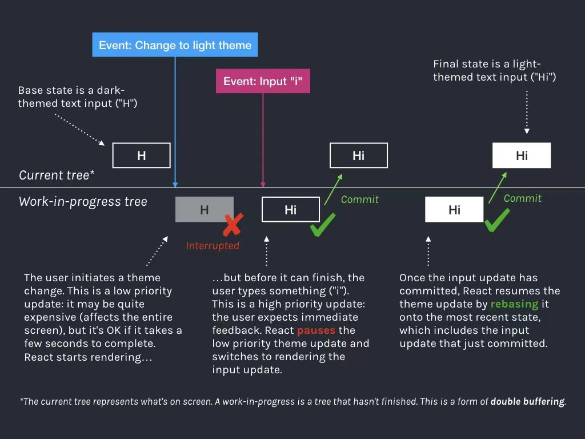
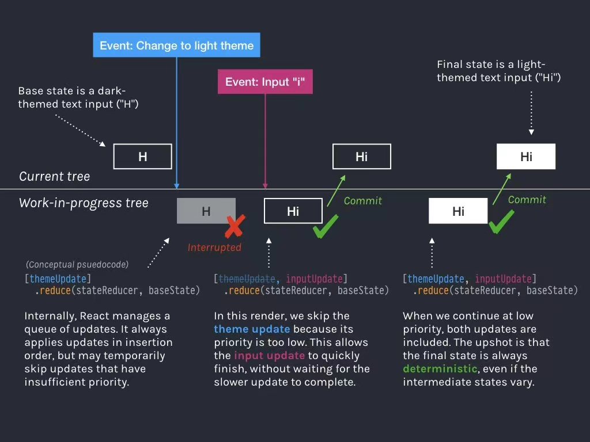

## Foreword

From the earlier ariticle of the `concept of React`, we know that `React` implement the human computer interaction to the real `UI`. `user interaction` cause the `state update` and user has their expection of the `interation` execute order. `React` assign different `priority` to the `state update` based on their research. Which includings

- life-cycle method, execute synchronously.
- user input, execute synchronously.
- interation event, animation for example, high priority.
- other, data request for example, low priority.

## How to Schdule Priority

From the previous section we know that `React` use `Scheduler` shedule the tasks.

Take a look with the source code, `React` will use the method `runWithPriority` provided by `Schduler` everytime when the takes need schedule.

This method recevie a `priority` variable and a `callback function` a the perameters. This `callback function` ordered by the `priority`. The `callback funtion` usally is the enter point of the `render`. [You can check the source code and the defination of the `runWithPriority` from here.](https://github.com/facebook/react/blob/970fa122d8188bafa600e9b5214833487fbf1092/packages/scheduler/src/Scheduler.js#L217)

## Demo

`priority` will presents on the `update.lane`, we only need to know this variable could identify the `priority` of `Update`. We are going to use an example to show how priority decide the order of updates.

> [This example from `Andrew`'s tweet.](https://twitter.com/acdlite/status/978412930973687808)




There are two `Update` om this demo, we named the `Update` of `Change to light theme`as `u1` and `Input 'i'` as `u2`.

`u1` trigger first and `render`, it is low priority which needs long execute time.

```js
fiber.updateQueue = {
  baseState: {
    blackTheme: true,
    text: 'H'
  },
  firstBaseUpdate: null,
  lastBaseUpdate: null
  shared: {
    pending: u1
  },
  effects: null
};
```

before `u1` finish `render`, the `u2` created by user enter the letter `i`. And this update belongs to the high priority group, which means it will interrupt the render of `u1`.

```
fiber.updateQueue.shared.pending === u2 ----> u1
                                     ^        |
                                     |________|
// which means
u2.next === u1;
u1.next === u2;
```

`u2` has higher priority compared with `u1`.

Followed by the `render` of `u2`, in the `processUpdateQueue`, circle chain table `sared.pending` will be cut and spliced after baseUpdate.

Then, traversal `baseUpdate`, process one of the `Update` (which is `u2` here).

Since `u2` is not the first `update` in the `baseUpdate`, `u1` sikpped here. And those skipped updates will be the `baseUpdate` for the next time update.

Till now, `u2` has finsihed the procress `render - commit`.

```js
fiber.updateQueue = {
  baseState: {
    blackTheme: true,
    text: 'HI'
  },
  firstBaseUpdate: u1,
  lastBaseUpdate: u2
  shared: {
    pending: null
  },
  effects: null
};
```

There is another scheduled update in the end of `commit` stage. During this updata, another `render` will start based on the `u1` saved from the `firstBaseUpdate` in `baseState`.

After twice `update`, the result should be looks like

```js
fiber.updateQueue = {
  baseState: {
    blackTheme: false,
    text: 'HI'
  },
  firstBaseUpdate: null,
  lastBaseUpdate: null
  shared: {
    pending: null
  },
  effects: null
};
```

As we can see that, update of `u2` has been execute twice, same as the life cycle hooks `componentWillXXX`. That is the reason why those hooks are marked `unsafe_`.

## How to make sure the state is right

Now we know the basic workflow of the `updateQueue`, but there are some more questions includes

- `render` stage might be interrupted. How to make sure the `Update` saved in `updateQueue` not lost?
- Sometime current `state` need dependencies from the previous `state`. How to support ignoring `low priority` states while ensuring continuity of state dependencies?

### keep `Update` not lost

In the previous example, we said that during the `render` phase, the circle of `shared.pending` is clipped and attached behind `updateQueue.lastBaseUpdate`.

In fact, `shared.pending` will be connected behind both `workInProgress updateQueue.lastBaseUpdate` and `current updateQueue.lastBaseUpdate`.

[You can check the soure code here.](https://github.com/facebook/react/blob/970fa122d8188bafa600e9b5214833487fbf1092/packages/react-reconciler/src/ReactUpdateQueue.new.js#L424)

When the `render` phase is interrupted and restarted, the `workInProgress updateQueue` is cloned based on `current updateQueue`. it is not lost because `current updateQueue.lastBaseUpdate` has already saved the last `Update`.

When the `commit` phase finishes rendering, the `Update` will not be lost when the `workInProgress Fiber tree` becomes the `current Fiber tree` because the last `Update` is saved in `workInProgress updateQueue.lastBaseUpdate`.

### ensuring continuity of state dependencies

When an `Update` is skipped due to its low priority, it is not only the `Update` that is stored in `baseUpdate`, but also all the `Update` after it in the chain.

Think about this example

```
baseState: ''
shared.pending: A1 --> B2 --> C1 --> D2
```

`Letters` presenting the letter needs to be inserted to the page in the `Update`. Numbers standing for the priority, lower number means higher priority.

First time `render`, `priority` is `

```
baseState: ''
baseUpdate: null
Update suring the render: [A1, C1]
memoizedState: 'AC'
```

Where `B2` is lower than the current priority, so including itself and all `Update` after it are saved in `baseUpdate` as the next update `Update` (i.e. B2 C1 D2).

This is to ensuring the order of dependencies before and after the `state`.

Second `render`, which `priority` is 2

```
baseState: 'A'
baseUpdate: B2 --> C1 --> D2
Update suring the render: [B2, C1, D2]
memoizedState: 'ABCD'
```

Be careful of the `baseState` here, it does not means the `memoizedState` of last update, because `B2` is skipped.

[You can check the source code of this logic here.](https://github.com/facebook/react/blob/970fa122d8188bafa600e9b5214833487fbf1092/packages/react-reconciler/src/ReactUpdateQueue.new.js#L479)

Through the above example we can find that `React` guarantees that the final state must be consistent with the `interaction` triggered by the user, but the state during the process may be different according to the different devices.
