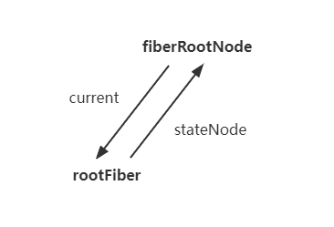

## Foreword

We have now going to talk about the starter of `React` application. In this ariticle, we will finish the whole process of `render`, which is `ReactDOM.render` here.

## Create Fiber

From the `Double Buffer` article, we know that when we first time run the `ReactDOM.render`, `fiberRootNode` and `rootFiber` will be created. `fiberRootNode` is the `root node` of the whole application and `rootFiber` is the `root node`of the render component tree.

This happen in the `legactRenderSubtreeIntoContainer` method, which ia called after `ReactDOM.render`. 

```js
// container means the second parameter of the ReactDOM.render
root = container._reactRootContainer = legacyCreateRootFromDOMContainer(
  container,
  forceHydrate,
);
fiberRoot = root._internalRoot;
```
[You can check the source code from here.](https://github.com/facebook/react/blob/1fb18e22ae66fdb1dc127347e169e73948778e5a/packages/react-dom/src/client/ReactDOMLegacy.js#L193)

In the `legacyCreateRootFromDOMContainer` method, `fiberRootNote` and `rootFiber` will be create and connect by calling `createFiberRoot` and initilize `updateQueue`.

```js
export function createFiberRoot(
  containerInfo: any,
  tag: RootTag,
  hydrate: boolean,
  hydrationCallbacks: null | SuspenseHydrationCallbacks,
): FiberRoot {
  // create fiberRootNode
  const root: FiberRoot = (new FiberRootNode(containerInfo, tag, hydrate): any);
  
  // create rootFiber
  const uninitializedFiber = createHostRootFiber(tag);

  // connect rootFiber and fiberRootNode
  root.current = uninitializedFiber;
  uninitializedFiber.stateNode = root;

  // initialize updateQueue
  initializeUpdateQueue(uninitializedFiber);

  return root;
}
```

Based on the code above, we could fill up the conntection between `rootFiber` and `fiberRootNode`.



[You cen check the source code from here.](https://github.com/facebook/react/blob/1fb18e22ae66fdb1dc127347e169e73948778e5a/packages/react-reconciler/src/ReactFiberRoot.new.js#L97)

## Create Update

After the components have been initialized, we are waiting for the `update`, which happened in the `updateContainer` method.

```js
export function updateContainer(
  element: ReactNodeList,
  container: OpaqueRoot,
  parentComponent: ?React$Component<any, any>,
  callback: ?Function,
): Lane {
  // ...

  // create update
  const update = createUpdate(eventTime, lane, suspenseConfig);
  
  // update.payload is the component need to mount on the root node
  update.payload = {element};

  // callback is the third parameter of the ReactDOM.render
  callback = callback === undefined ? null : callback;
  if (callback !== null) {
    update.callback = callback;
  }

  // add update to the updateQueue
  enqueueUpdate(current, update);
  // scheduke update
  scheduleUpdateOnFiber(current, lane, eventTime);

  // ...
}
```

[You can find the complete source code of `updateContainer` here.](https://github.com/facebook/react/blob/1fb18e22ae66fdb1dc127347e169e73948778e5a/packages/react-reconciler/src/ReactFiberReconciler.new.js#L255)

You might find out that `update.payload = {element};`. This is what we have talked in the previous ariticle `Update`, for `HostRoot`, `payload` is the first parameter of `ReactDOM.render`.

## Workflow

So far, we could find the workflow should be look like

```sh
create fiberRootNode, rootFiber and updateQueue (`legacyCreateRootFromDOMContainer`)

    |
    |
    v

create Update object (`updateContainer`)

    |
    |
    v

from fiber to root (`markUpdateLaneFromFiberToRoot`)

    |
    |
    v

update schedule (`ensureRootIsScheduled`)
    |
    |
    v

render (`performSyncWorkOnRoot`) or (`performConcurrentWorkOnRoot`)

    |
    |
    v

commit (`commitRoot`)
```
